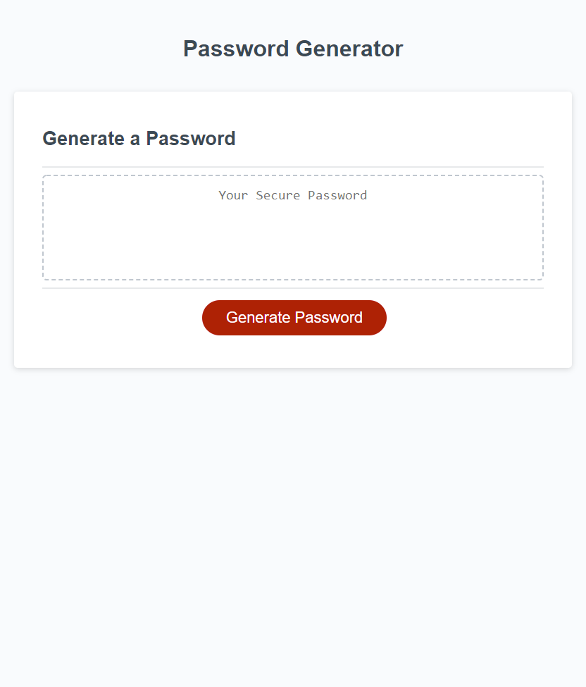

# Password Generator 
## Description
The starter code had no functionality to create a unique password.

* Added Uppercase, Lowercase, symbols and numbers in order to create a truly random password.
* Ensured script requested the use of between 8 and 128 characters.
* Made sure script asked if all 4 variables wanted to be used using a while loop.
* Ensured that whatever combination of variables were selected that it printed out the correct password format.

## Screenshot of landing page.

## Live link to website

Live link at GitHub: [Password Gen](https://mpergolatti.github.io/PasswordGen/)